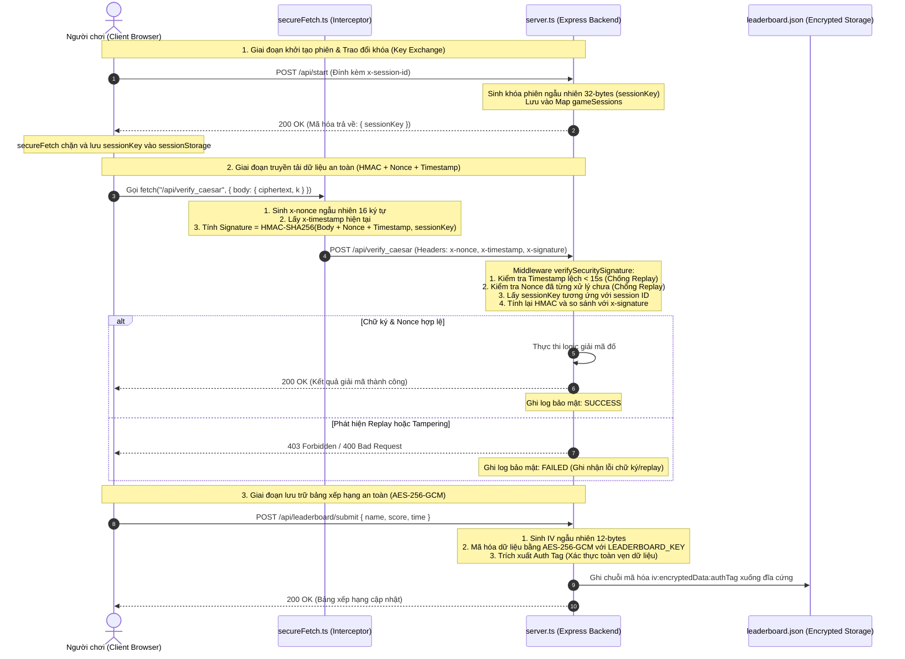

# Cryptographic Protocol & System Architecture Design

Tài liệu này mô tả chi tiết thiết kế kiến trúc hệ thống và giao thức bảo mật mật mã đã triển khai cho hệ thống game **Huyền Thoại Bẻ Khóa**.

---

## 1. Sơ đồ giao thức bảo mật (Sequence Diagram)

---

## 2. Quy trình chi tiết của Giao thức

### A. Khởi tạo phiên và trao đổi khóa (Session Initialization & Key Exchange)
* Nhằm giải quyết yêu cầu **không hardcode khóa bí mật**, hệ thống thiết lập cơ chế sinh khóa ngẫu nhiên trên máy chủ cho từng phiên làm việc của người dùng.
* Khi client tải trang lần đầu tiên, client gửi yêu cầu `POST /api/start` kèm theo `x-session-id` tự sinh trong storage.
* Server sinh khóa đối xứng ngẫu nhiên $K_{session}$ có độ dài 256 bits (32 bytes) bằng bộ sinh số ngẫu nhiên an toàn mật mã (`crypto.randomBytes(32)`). Khóa này được liên kết trực tiếp với `x-session-id` và lưu trữ trong bộ nhớ RAM của server.
* Khóa $K_{session}$ được trả về cho Client một lần duy nhất trong phản hồi khởi tạo. Trình chặn `secureFetch.ts` của client sẽ bắt lấy khóa này và lưu vào `sessionStorage` để phục vụ ký thông điệp sau đó.

### B. Cơ chế bảo vệ toàn vẹn dữ liệu và chống phát lại (Integrity & Anti-Replay)
Với mọi yêu cầu gửi dữ liệu giải đố lên Server (ngoại trừ `/api/start` và `GET /api/leaderboard` là công khai), Client bắt buộc phải đính kèm 3 headers bảo mật:
1. `x-timestamp`: Thời gian gửi yêu cầu (Unix epoch miliseconds).
2. `x-nonce`: Chuỗi ký tự ngẫu nhiên duy nhất (UUID rút gọn).
3. `x-signature`: Chữ ký xác thực toàn vẹn của yêu cầu.

#### Phía Client (Đóng gói và Ký thông điệp):
* Chuỗi dữ liệu cần ký được tạo ra bằng cách nối:
  $$\text{Payload} = \text{Request Body String} + \text{nonce} + \text{timestamp}$$
* Client sử dụng Web Crypto API để tính toán chữ ký HMAC-SHA256 trên chuỗi Payload với khóa bí mật $K_{session}$:
  $$\text{Signature} = \text{HMAC-SHA256}(\text{Payload}, K_{session})$$
* Chữ ký này được gán vào header `x-signature` trước khi truyền đi.

#### Phía Server (Kiểm thử, Chống Replay và Xác minh):
* **Bước 1 (Cửa sổ thời gian):** Server đọc `x-timestamp` và so sánh với thời gian hiện tại của Server. Nếu chênh lệch vượt quá $\pm 15$ giây, Server từ chối xử lý ngay lập tức (phòng ngừa việc Hacker lưu lại gói tin và gửi lại sau đó).
* **Bước 2 (Chống trùng lặp Nonce):** Server kiểm tra xem `x-nonce` đã nằm trong danh sách các nonce đã xử lý (`processedNonces` map) chưa. Nếu có, Server chặn yêu cầu và báo lỗi Replay. Nếu chưa có, nonce này được đưa vào map kèm theo thời gian hết hạn là 15 giây.
* **Bước 3 (Xác thực chữ ký):** Server trích xuất `x-session-id`, tra cứu khóa phiên $K_{session}$ tương ứng, tính toán lại HMAC trên Payload nhận được và so sánh với `x-signature` từ Client. Nếu hai chữ ký khớp nhau 100%, thông điệp được đảm bảo:
  * Không bị thay đổi dữ liệu trên đường truyền (Integrity).
  * Do chính người chơi hợp lệ sở hữu phiên gửi lên (Authenticity).
  * Không bị gửi lại lần thứ hai (Non-repudiation & Anti-replay).

### C. Cơ chế bảo vệ dữ liệu lưu trữ (Encrypted Storage)
* Bảng xếp hạng điểm số cao (`leaderboard.json`) được lưu trữ trên server.
* Để chống việc sửa đổi điểm trái phép trực tiếp trên hệ thống file, Server áp dụng mã hóa xác thực **AES-256-GCM** (chế độ AEAD khuyến nghị).
* Khóa mã hóa $K_{store}$ được dẫn xuất từ biến môi trường của hệ thống bằng thuật toán dẫn xuất khóa `crypto.scryptSync`.
* Khi lưu file, hệ thống sinh IV ngẫu nhiên 12-bytes và tạo ra bản mã kèm theo thẻ xác thực toàn vẹn (Auth Tag) 16-bytes. Chuỗi lưu xuống file có định dạng:
  $$\text{iv}_{\text{hex}} + ":" + \text{ciphertext}_{\text{hex}} + ":" + \text{authTag}_{\text{hex}}$$
* Khi đọc file, hệ thống thực hiện tách chuỗi, thiết lập Auth Tag để xác minh dữ liệu không bị sửa đổi trên đĩa cứng trước khi giải mã. Nếu Auth Tag không hợp lệ (file bị chỉnh sửa trực tiếp), hệ thống sẽ chặn và ghi log lỗi cảnh báo bảo mật.
