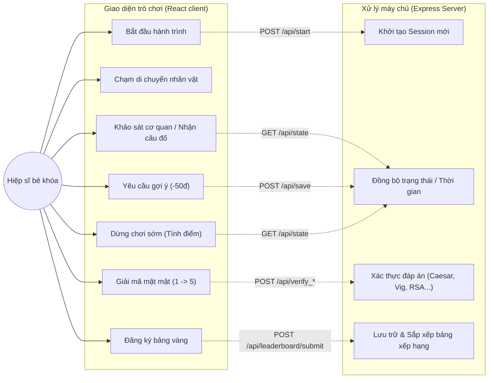
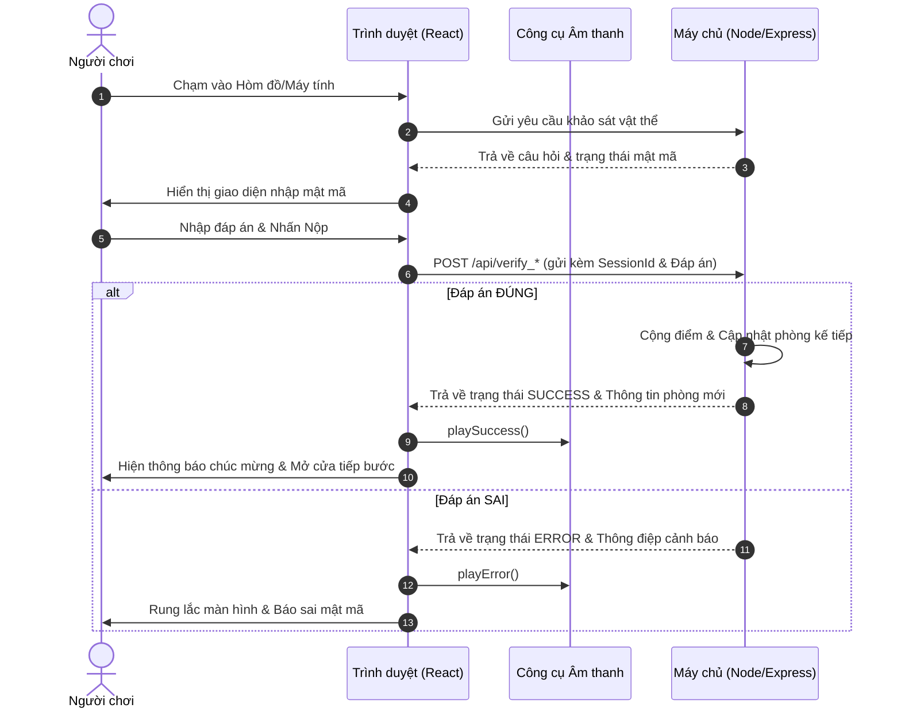
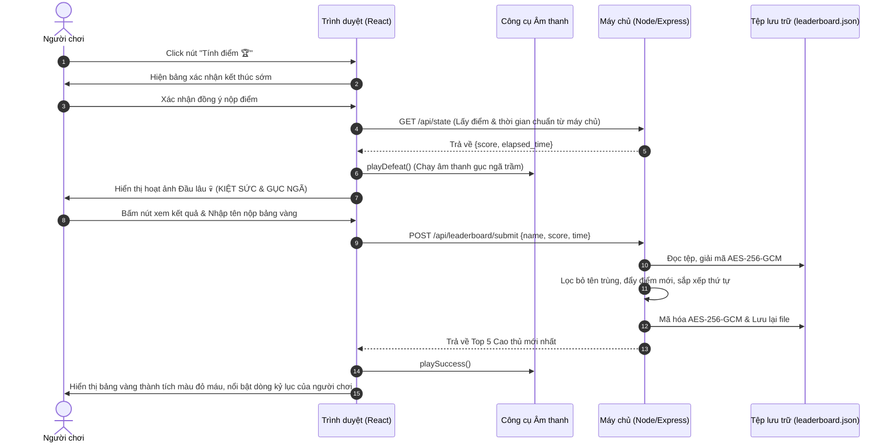
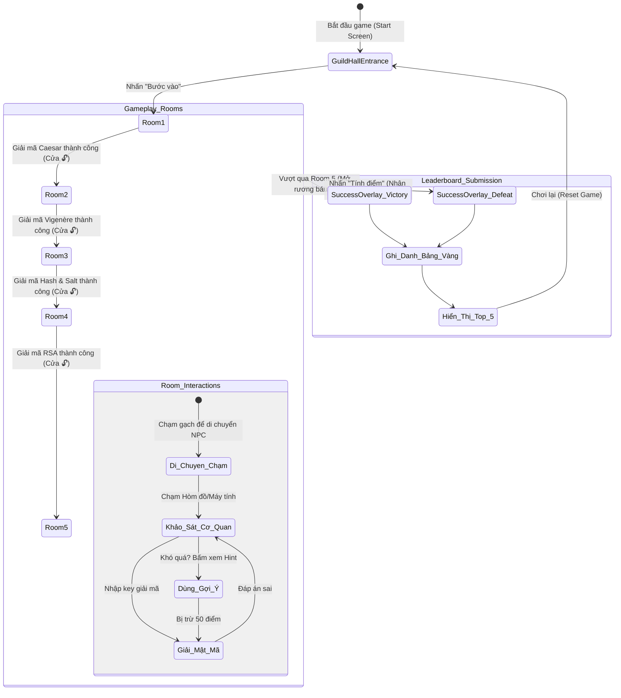

# SƠ ĐỒ CHỨC NĂNG & QUAN HỆ HỆ THỐNG - GAME "HUYỀN THOẠI BẺ KHÓA"

Tài liệu này mô tả chi tiết kiến trúc chức năng, luồng hoạt động và mối quan hệ giữa các cấu phần trong trò chơi giải mã mật mã học "Huyền Thoại Bẻ Khóa" (thu2).

---

## 1. Sơ đồ Phân rã Chức năng (Functional Decomposition)

Sơ đồ thể hiện cấu trúc phân cấp các tính năng của trò chơi từ cấp độ tổng quan đến các chức năng chi tiết.

```mermaid
graph TD
    Root["🎮 HUYỀN THOẠI BẺ KHÓA"]
    
    %% Main Branches
    G1["🕹️ HỆ THỐNG GAMEPLAY"]
    G2["🏆 BẢNG VÀNG CAO THỦ"]
    G3["⚙️ BỘ MÁY BACKEND"]
    G4["📺 GIAO DIỆN & HIỆU ỨNG"]

    Root --> G1
    Root --> G2
    Root --> G3
    Root --> G4

    %% Gameplay details
    G1 --> GP1["Touch/Click Di chuyển"]
    G1 --> GP2["Khảo sát vật thể (Inspect)"]
    G1 --> GP3["Giải mã mật phòng (1-5)"]
    G1 --> GP4["Hệ thống Gợi ý (-50đ)"]
    G1 --> GP5["Dừng chơi & Tính điểm"]

    %% Leaderboard details
    G2 --> LB1["Tải bảng xếp hạng"]
    G2 --> LB2["Khắc tên & Nộp điểm"]
    G2 --> LB3["Sắp xếp thứ hạng (Score/Time)"]

    %% Backend details
    G3 --> BE1["Khởi tạo Session (/api/start)"]
    G3 --> BE2["Lưu vết & Đồng bộ (/api/state, /api/save)"]
    G3 --> BE3["Mã hóa bảo mật tệp (AES-256-GCM)"]
    G3 --> BE4["Kiểm thử chữ ký chống gian lận (Sign/Nonce)"]

    %% UI/UX details
    G4 --> UI1["Responsive co giãn thông minh (CSS Scale)"]
    G4 --> UI2["Hoạt ảnh chiến thắng (Rương vàng)"]
    G4 --> UI3["Hoạt ảnh gục ngã (Đầu lâu u ám)"]
    G4 --> UI4["Bộ tổng hợp âm thanh (Audio Synthesizer)"]
```

---

## 2. Sơ đồ Ca sử dụng (Use Case Diagram)

Mô tả sự tương tác của Người chơi (Actor) với các tính năng của hệ thống và luồng xử lý tương ứng trên Frontend/Backend.

---

## 3. Sơ đồ Tuần tự Chức năng (Sequence Diagram)

Mô tả luồng đi của dữ liệu giữa Trình duyệt (Client), Bộ phát âm thanh (Audio Engine), Máy chủ (Backend), và File lưu trữ mã hóa (Database) cho hai trường hợp: **Giải câu đố** và **Dừng chơi sớm**.

### A. Luồng Khảo sát và Xác thực câu đố (Inspect & Verify)

### B. Luồng Dừng chơi sớm & Nộp điểm (Force Finish & Leaderboard Save)

---

## 4. Sơ đồ Luồng hoạt động & Chuyển trạng thái (Activity/State Flow)

Mô tả chu kỳ trạng thái của Game từ lúc bắt đầu cho đến khi kết thúc (thắng cuộc hoặc gục ngã).

