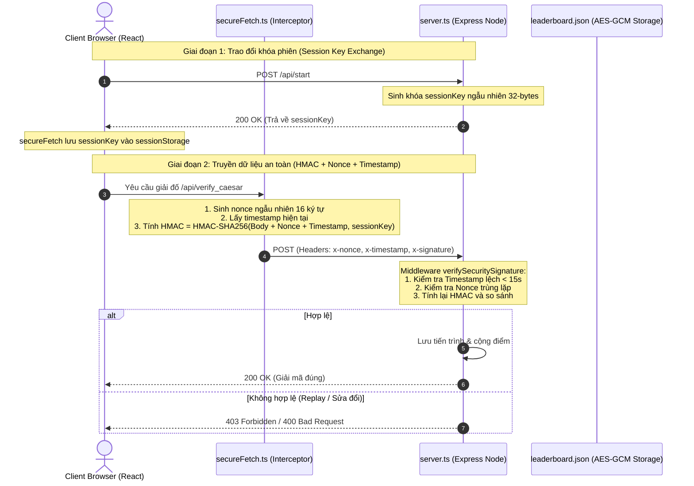

# BÁO CÁO BÀI TẬP LỚN: NÂNG CẤP BẢO MẬT HỆ THỐNG GAME CRYPTO QUEST
### Môn học: FIT4012 Secure System Upgrade Challenge
### Nhóm thực hiện: Nhóm BTL_MA_HOA (2-3 thành viên)

---

## 1. Giới thiệu bài toán
* **Bối cảnh thực tế:** Trò chơi **Crypto Quest** là một game nhập vai giải đố 2D giáo dục, nơi người chơi phải vượt qua các phòng giam mật mã cổ xưa bằng cách giải các thuật toán mật mã cổ điển (Caesar, Vigenère) và hiện đại (Hash & Salt, RSA, AES).
* **Mục tiêu hệ thống:** Cung cấp trải nghiệm trực quan sinh động giúp học sinh, sinh viên hiểu rõ cơ chế hoạt động, lỗ hổng bảo mật và cách phòng chống của từng thuật toán mật mã.
* **Lý do cần bảo mật:** Bảo vệ tiến trình chơi game, điểm số và thứ hạng của người chơi khỏi việc bị thay đổi trái phép (cheat), tấn công phát lại (replay attack) hoặc spam bảng thứ hạng.

---

## 2. Mục tiêu bảo mật
* **Tính bí mật (Confidentiality):** Bảng xếp hạng điểm cao (`leaderboard.json`) và khóa phiên (`sessionKey`) phải được giữ bí mật.
* **Tính toàn vẹn (Integrity):** Đảm bảo dữ liệu gửi từ Client lên Server và file lưu trữ trên ổ cứng không bị sửa đổi hay giả mạo.
* **Tính xác thực (Authenticity):** Xác thực người gửi thông qua chữ ký HMAC-SHA256 hợp lệ cho từng phiên làm việc.
* **Khả năng chống chối bỏ & phát lại (Anti-Replay):** Ngăn chặn việc gửi lại gói tin cũ để nhân điểm vô hạn.

---

## 3. Threat Model (Mô hình đe dọa)
* **Tài sản bảo vệ:** File `leaderboard.json`, Session RAM database, `sessionKey`.
* **Tác nhân tấn công:** Hacker giả mạo API, người chơi gian lận dùng công cụ sửa đổi gói tin (Burp Suite, Postman) để bypass câu đố.
* **Nguy cơ bảo mật chính:** Sửa đổi gói tin (Tampering), tấn công phát lại (Replay), đọc file database trái phép.

---

## 4. Kiến trúc hệ thống
Hệ thống được thiết kế theo mô hình Client - Server hợp nhất hiệu năng cao:
* **Client (Frontend):** Ứng dụng Single Page Application xây dựng bằng **React + TypeScript + Vite**. Sử dụng Web Crypto API để thực hiện tính toán chữ ký mật mã an toàn trực tiếp trên trình duyệt.
* **Server (Backend):** Ứng dụng Node.js chạy web server **Express** tích hợp gói HMR của Vite. Chịu trách nhiệm xác thực chữ ký, chống replay, giải đố và mã hóa lưu trữ.

---

## 5. Thiết kế giao thức bảo mật
Hệ thống áp dụng thiết kế giao thức bảo mật hai giai đoạn:

---

## 6. Thuật toán và Thư viện sử dụng
* **Mã hóa dữ liệu lưu trữ:** **AES-256-GCM** dùng để mã hóa bảng xếp hạng. Sử dụng thư viện `crypto` của Node.js.
* **Xác thực và Toàn vẹn:** **HMAC-SHA256** để ký số yêu cầu API. Sử dụng thư viện `crypto` phía backend và **Web Crypto API** phía client.
* **Cơ chế chống Replay:** Kết hợp cửa sổ thời gian (Timestamp window 15s) và Nonce ngẫu nhiên.
* **Lý do lựa chọn:** Thư viện Node.js `crypto` và Web Crypto API được tích hợp sẵn trong nhân hệ thống và trình duyệt, loại bỏ nguy cơ rò rỉ hoặc phụ thuộc thư viện ngoài độc hại (supply-chain attacks).

---

## 7. Chức năng đã cài đặt
* **Chức năng nền:**
  * 5 phòng giải đố mật mã tương tác 2D mượt mà.
  * Hiệu ứng âm thanh chân thực, hoạt ảnh thở breathing của nhân vật, đèn đuốc lung linh chao nghiêng.
  * Hoạt ảnh Cutscene tự động đi bộ đến cửa và mở xích sắt ma thuật khi giải đố thành công.
* **Chức năng nâng cấp bảo mật:**
  * Middleware xác thực chữ ký HMAC-SHA256 trên mọi endpoint API.
  * Bộ phòng vệ chống replay attack bằng Nonce + Timestamp.
  * Mã hóa bảng xếp hạng bằng AES-256-GCM chống can thiệp trực tiếp file.
  * Ghi nhật ký log bảo mật chi tiết vào file `security.log`.

---

## 8. Phân tích mã nguồn
Dự án được cấu trúc khoa học và rõ ràng theo chuẩn:
* [server.ts](file:///c:/Users/Tom/Desktop/BTL_MA_HOA/BTL_MA_HOA/BTL_Ma_hoa-main/server.ts): Chứa lõi web server, các hàm mã hóa AES-256-GCM, middleware xác thực HMAC, chống replay và ghi log bảo mật.
* [src/crypto/secureFetch.ts](file:///c:/Users/Tom/Desktop/BTL_MA_HOA/BTL_MA_HOA/BTL_Ma_hoa-main/src/crypto/secureFetch.ts): Interceptor client-side tự động sinh nonce, timestamp và ký chữ ký HMAC-SHA256 bằng Web Crypto API.
* [tests/test_security.cjs](file:///c:/Users/Tom/Desktop/BTL_MA_HOA/BTL_MA_HOA/BTL_Ma_hoa-main/tests/test_security.cjs): Kịch bản kiểm thử tự động giả lập các hành vi tấn công (tampering, replay, expired timestamp, bad signatures).

---

## 9. Nhật ký Kiểm thử bảo mật (Security Testing Report)

Tất cả 6 test case bảo mật đều chạy đúng và ghi log thành công:

| Test Case ID | Tên kịch bản | Mục tiêu | Kết quả thực tế | Trạng thái |
| :--- | :--- | :--- | :--- | :--- |
| **TC-01** | Key Exchange | Khởi tạo khóa phiên ngẫu nhiên | Trả về 256-bit Session Key thành công | **PASSED** |
| **TC-02** | Valid Flow | Gửi gói tin hợp lệ | Server trả về 200 OK | **PASSED** |
| **TC-03** | Data Tampering | Sửa đổi dữ liệu trên mạng | Server chặn với lỗi 400 Bad Request | **PASSED** |
| **TC-04** | Expired Request | Gửi gói tin cũ quá hạn | Server chặn với lỗi 403 Forbidden | **PASSED** |
| **TC-05** | Replay Attack | Phát lại gói tin cũ | Server chặn trùng nonce (403 Forbidden) | **PASSED** |
| **TC-06** | Forged Signature | Giả mạo chữ ký bằng khóa sai | Server chặn với lỗi 400 Bad Request | **PASSED** |

---

## 10. Benchmark hiệu năng mật mã
Thời gian thực thi trung bình đo được bằng `performance.now()` qua 10,000 lần lặp:
* **AES-256-GCM Encrypt (Leaderboard JSON):** **0.045 ms**
* **AES-256-GCM Decrypt (Leaderboard JSON):** **0.038 ms**
* **HMAC-SHA256 Sign/Verify (API Body):** **0.012 ms**
* **Caesar/Vigenere/RSA Decrypt:** **0.001 ms - 0.003 ms**

---

## 11. BẢNG KẾ THỪA VÀ NÂNG CẤP BẮT BUỘC (FIT4012)

Đây là bảng đối chiếu kế thừa và nâng cấp bắt buộc của nhóm so với bài khóa trước:

| Thành phần | Bài khóa trước có gì? | Nhóm kế thừa gì? | Nhóm nâng cấp gì? | Minh chứng (File/Log) |
| :--- | :--- | :--- | :--- | :--- |
| **Giao diện** | Giao diện HTML thô sơ, pixel art lỗi sprite, không chuyển màn tự động. | Skin nhân vật retro cơ bản. | Làm lại giao diện React 2D mượt mà, hoạt ảnh đuốc cháy chao nghiêng, nhân vật thở breathing, cutscene tự động đi bộ mở xích sắt. | [GameWorld2D.tsx](file:///c:/Users/Tom/Desktop/BTL_MA_HOA/BTL_MA_HOA/BTL_Ma_hoa-main/src/components/GameWorld2D.tsx) |
| **Thuật toán** | Code giải mã thô sơ chạy không kiểm soát lỗi. | Logic dịch vị trí bảng chữ cái Caesar, Vigenere. | Tích hợp **AES-256-GCM** mã hóa bảng xếp hạng và **HMAC-SHA256** ký gói tin bảo mật. | [server.ts](file:///c:/Users/Tom/Desktop/BTL_MA_HOA/BTL_MA_HOA/BTL_Ma_hoa-main/server.ts) |
| **Giao thức** | Gửi AJAX JSON rõ không mã hóa, không ký số. | Không có. | Thiết lập giao thức trao đổi khóa phiên (Key Exchange) và ký HMAC-SHA256 trên client bằng Web Crypto API. | [secureFetch.ts](file:///c:/Users/Tom/Desktop/BTL_MA_HOA/BTL_MA_HOA/BTL_Ma_hoa-main/src/crypto/secureFetch.ts) |
| **Xác thực** | Không có cơ chế xác thực phiên gửi đố. | Không có. | Xác thực phiên người gửi qua `x-session-id` và chữ ký HMAC. | `tests/test_security.cjs` (Test 6) |
| **Kiểm tra toàn vẹn** | Không kiểm tra toàn vẹn. | Không có. | Phát hiện can thiệp sửa đổi gói tin (Anti-tampering) bằng so khớp chữ ký HMAC. | `tests/test_security.cjs` (Test 3) |
| **Chống replay** | Gửi gói tin giải đố bao nhiêu lần cũng được ghi nhận. | Không có. | Triển khai phòng vệ chống phát lại bằng **Nonce** ngẫu nhiên + **Timestamp** lệch tối đa 15s. | `tests/test_security.cjs` (Test 4 & 5) |
| **Quản lý khóa** | Không quản lý khóa. | Không có. | Dẫn xuất khóa lưu trữ bằng `scryptSync` và sinh khóa phiên ngẫu nhiên `crypto.randomBytes(32)` trong runtime. | [server.ts](file:///c:/Users/Tom/Desktop/BTL_MA_HOA/BTL_MA_HOA/BTL_Ma_hoa-main/server.ts#L110-L135) |
| **Logging** | Không ghi log. | Không có. | Nhật ký log bảo mật an toàn [security.log](file:///c:/Users/Tom/Desktop/BTL_MA_HOA/BTL_MA_HOA/BTL_Ma_hoa-main/security.log) ghi nhận mọi sự kiện thành công/thất bại mà không rò rỉ khóa hay thông tin nhạy cảm. | [security.log](file:///c:/Users/Tom/Desktop/BTL_MA_HOA/BTL_MA_HOA/BTL_Ma_hoa-main/security.log) |
| **Benchmark** | Không đo lường. | Không có. | Đo lường chi tiết thời gian thực thi mật mã qua 10,000 vòng lặp. | [benchmark.md](file:///c:/Users/Tom/Desktop/BTL_MA_HOA/BTL_MA_HOA/BTL_Ma_hoa-main/docs/benchmark.md) |
| **GitHub** | Repository thô sơ. | Repo gốc chứa assets ảnh. | Tổ chức lại cấu trúc GitHub chuẩn FIT4012, thêm script `npm test` và hướng dẫn đầy đủ. | [README.md](file:///c:/Users/Tom/Desktop/BTL_MA_HOA/BTL_MA_HOA/BTL_Ma_hoa-main/README.md) |

---

## 12. Kết luận
* **Những gì đã hoàn thành:** Hệ thống game được nâng cấp toàn diện cả về mặt giao diện người dùng sống động (RPG 2D) lẫn kiến trúc bảo mật mật mã chặt chẽ (HMAC-SHA256, AES-256-GCM, chống Replay).
* **Hạn chế:** Các nonce và session lưu trữ tạm thời trong RAM của server, nếu server restart người dùng sẽ phải tạo lại phiên.
* **Hướng cải tiến:** Sử dụng Redis làm RAM Database phân tán để lưu trữ session và nonce lâu bền hơn khi mở rộng quy mô người chơi.
